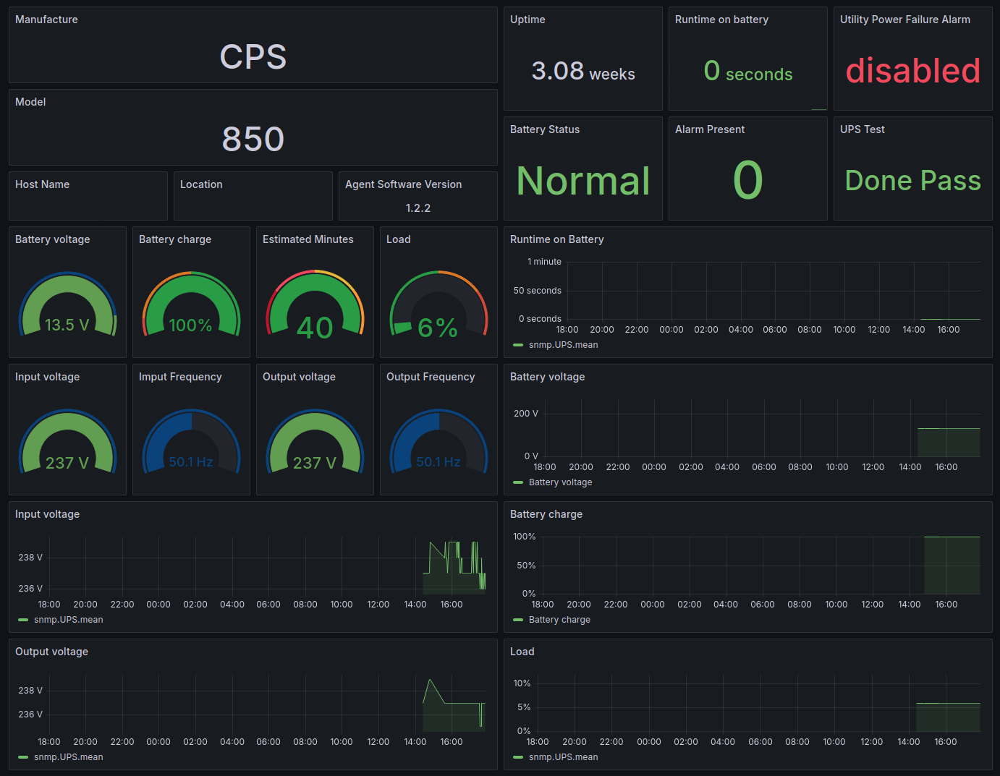

# UPS-Monitor
Telegraf InfluxDB Grafana Monitor for UPS trought SNMP

It works with "[EPYC NEON UPS](https://www.justepyc.com/it/ups/1-48-epyc-neon-ups.html#/potenza-650_va)" recognized by 'lsusb' as "Cyber Power System, Inc. PR1500LCDRT2U UPS" and managed by [PowerMaster+ (SNMP v1) 1.2.2](https://www.powermonitor.software/#PowerMasterPlusSoftware) 

